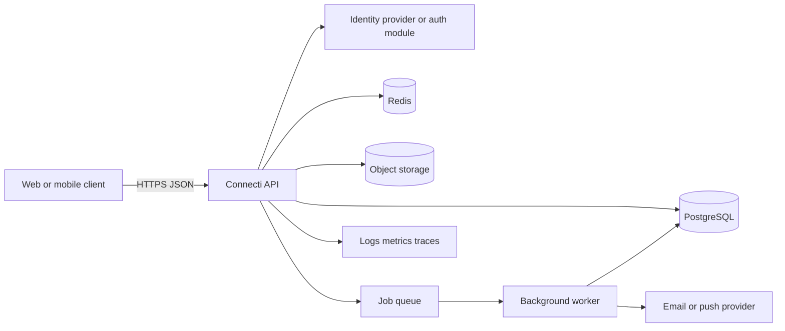
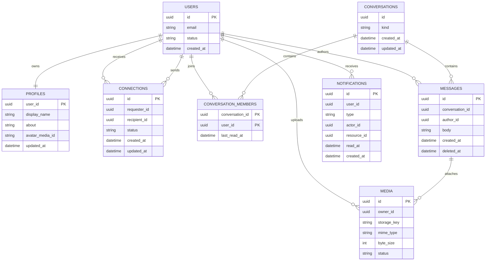

# Connecti Backend Architecture

**Status:** Foundation implemented; domain modules pending product decisions
**Scope:** MVP backend
**Source of truth:** The current Connectify application under `apps/web/connectify`
is the behavioral reference for this backend. See
[Frontend-derived backend contract](./frontend-derived-backend-contract.md)
for the API lifecycle and product rules that override earlier assumptions in
this document.

## 1. Goals and Assumptions

Connecti is treated as a connection product where a signed-in person can:

- create and manage a profile;
- discover other people;
- send and remove directed likes;
- match after reciprocal likes;
- start conversations with a valid like relationship;
- exchange messages;
- receive notification updates;
- upload profile media.

The MVP should be a modular monolith. One API process and one relational database keep transactions and deployment simple while preserving clear domain boundaries for later extraction.

Non-goals for the first release are recommendation ML, multi-region writes, end-to-end encryption, and microservices.

## 2. Current workspace structure

```text
apps/
  api/
    package.json
    tsconfig.json
    src/
      app.ts
      server.ts
      config/
      core/
      http/
      modules/
        health/
        auth/
        profiles/
        likes/
        conversations/
        preferences/
        media/
      routes/
      types/
  web/
    connectify/
      src/
        App.tsx
        pages/
          LandingPage.tsx
          DiscoveryPage.tsx
          MyProfilepage.tsx
          ProfileEditPage.tsx
          ProfilePage.tsx
          LikesPage.tsx
          MatchesPage.tsx
          MessagesPage.tsx
          SettingsPage.tsx
          auth/
        context/
          authContext/
          likeContext/
        components/
        layout/
        lib/
          mockApi.ts
          storage.ts
        data/
          mockProfile.ts
        types/
```

This structure separates the product client from the API, while keeping the
backend module naming aligned to the real feature surface exposed by the
Connectify web app.

## 3. System Context



### Runtime components

| Component      | Responsibility                                                       | MVP choice                                          |
| -------------- | -------------------------------------------------------------------- | --------------------------------------------------- |
| API            | HTTP transport, validation, authorization, domain orchestration      | Express + TypeScript in `apps/api`                  |
| Database       | Durable transactional state and search indexes                       | PostgreSQL                                          |
| Cache          | Rate limits, short-lived sessions, unread counters, idempotency keys | Redis; optional until needed                        |
| Object storage | Avatars and message attachments                                      | S3-compatible storage with signed URLs              |
| Worker         | Notifications, media processing, cleanup, fan-out work               | Separate TypeScript process using the same packages |
| Observability  | Structured logs, request IDs, metrics, error reporting               | Provider-neutral interfaces from day one            |

## 4. API Boundaries

The API is versioned under `/v1`. Responses use JSON and errors use one stable shape:

```json
{
  "error": {
    "code": "CONNECTION_ALREADY_EXISTS",
    "message": "A connection already exists between these users.",
    "requestId": "req_01...",
    "details": {}
  }
}
```

Every authenticated request receives `request.userId` from the verified access token. Clients never choose the acting user in the URL or request body.

### Identity and profile

- `POST /v1/auth/register`
- `POST /v1/auth/login`
- `POST /v1/auth/refresh`
- `POST /v1/auth/logout`
- `GET /v1/me`
- `PATCH /v1/me`
- `GET /v1/users/:userId`
- `GET /v1/users?query=&cursor=`

If an external identity provider is selected, register/login/refresh/logout become provider integration endpoints and the API stores only the local user record and provider subject.

### Connections

- `GET /v1/connections?status=accepted|pending&cursor=`
- `POST /v1/connections/:userId`
- `POST /v1/connections/:connectionId/accept`
- `POST /v1/connections/:connectionId/reject`
- `DELETE /v1/connections/:connectionId`

Connection creation must be idempotent for the same pair of users. A database constraint must prevent duplicate undirected relationships.

### Conversations and messages

- `GET /v1/conversations?cursor=`
- `POST /v1/conversations`
- `GET /v1/conversations/:conversationId/messages?cursor=`
- `POST /v1/conversations/:conversationId/messages`
- `POST /v1/conversations/:conversationId/read`
- `DELETE /v1/messages/:messageId` (soft delete)

Only conversation members can read or mutate conversation data. The initial MVP supports direct conversations; group conversations can be added without changing the message model by making membership explicit.

### Notifications and media

- `GET /v1/notifications?cursor=`
- `POST /v1/notifications/:notificationId/read`
- `POST /v1/media/upload-url`
- `POST /v1/media/:mediaId/complete`

Uploads use a short-lived signed URL. The API records metadata only after the client confirms the object was uploaded; the worker validates type, size, and malware scanning status before the media is public.

## 5. Domain Modules

Keep these modules inside the API application initially. Each module owns its commands, queries, validation, and persistence adapters; modules do not import another module's database tables directly.

```text
apps/api/src/
  server.ts                 # process bootstrap only
  app.ts                    # middleware and route composition
  config/env.ts             # validated runtime configuration
  core/errors/              # transport-independent application errors
  http/                     # request context and HTTP error handlers
  routes/v1.ts              # versioned route composition
  modules/
    health/                 # implemented liveness and readiness endpoints
    auth/                   # registration, verification, login, session hydration
    profiles/               # public discovery, profile reads, profile updates
    likes/                  # directed likes, match transitions, relationship state
    conversations/          # pair lookup, membership, message authorization
    preferences/            # notification choices and settings updates
    media/                  # signed profile-photo upload workflow
  infrastructure/
    db/ cache/ queue/ storage/ observability/ # added alongside integrations
```

A request should flow as:

```text
route -> request schema -> application command/query -> domain rules -> repository -> response mapper
```

Routes must not contain SQL, provider calls, or business rules.

## 6. Data Model

Use UUID or UUIDv7 identifiers, UTC timestamps, and soft deletion where user-visible history matters.



### Important constraints

- `users.email` is unique and normalized to lowercase.
- A connection stores the two user IDs in a canonical order, with a unique index on that pair.
- A direct conversation has a unique membership pair so repeated create calls return the existing conversation.
- `conversation_members` is the authorization source for messages.
- Message bodies are bounded in size and attachments are referenced by `media.id`.
- Notification creation is idempotent by event ID and notification type where duplicate delivery is possible.
- All foreign keys use restrictive deletion by default; account deletion is an explicit workflow.

## 7. Consistency and Events

User-facing mutations that change relationship state or message state are database transactions. For reliable asynchronous work, write an `outbox_events` row in the same transaction, then let the worker publish and mark it processed.

Initial events:

- `connection.requested`
- `connection.accepted`
- `connection.removed`
- `message.created`
- `media.uploaded`
- `user.deleted`

The outbox worker must retry with exponential backoff, preserve event IDs, and move repeatedly failing events to a dead-letter table. Consumers must be idempotent because delivery is at-least-once.

For realtime messaging, start with ordinary HTTP reads and writes. Add WebSocket or server-sent events only after the message endpoint is stable; realtime delivery is a presentation concern backed by the same persisted message and outbox event.

## 8. Security and Privacy

- Verify access tokens before route handlers and reject missing or expired credentials with `401`.
- Enforce resource ownership or membership in the application service, not only in the client.
- Validate all request bodies, query parameters, and uploaded media metadata at the boundary.
- Hash passwords with Argon2id if credentials are local; never store raw passwords or provider secrets in the database.
- Apply per-IP and per-user rate limits to authentication, search, connection requests, messages, and upload URL creation.
- Use generic login errors to avoid account enumeration and add email verification before high-volume actions.
- Store only required personal data, support account export/deletion workflows, and avoid logging message bodies or tokens.
- Use parameterized queries, secure headers, CORS allowlists, and TLS in every non-local environment.

## 9. Operational Requirements

### Configuration

Fail fast at startup for required production settings: `DATABASE_URL`, authentication secrets/provider configuration, storage credentials, and queue configuration. Keep `.env` loading local-only; production values come from the deployment secret manager.

### Health checks

- `GET /health/live`: process is running; no dependency checks.
- `GET /health/ready`: database, cache, queue, and storage dependencies are usable.

The existing `/health` endpoint should remain as a compatibility alias while these checks are introduced.

### Implemented API foundation

- `GET /health` returns a compatibility health response.
- `GET /v1/health/live` confirms the process is live.
- `GET /v1/health/ready` exposes readiness checks; dependency entries remain
  `not-configured` until database, cache, and queue adapters are added.
- Every request receives an `x-request-id` response header; callers may supply
  one through the same request header for end-to-end tracing.
- API errors have a stable JSON envelope, including a machine-readable code and
  request ID.
- The app enables secure HTTP headers, explicit CORS origins, a 1 MB JSON body
  limit, and startup-time environment validation.

### Logging and metrics

Emit JSON logs with `requestId`, route, status, duration, and user ID where available. Never log authorization headers, passwords, signed URLs, or message content. Track request latency/error rate, database pool saturation, queue lag, failed jobs, login failures, and unread-notification query latency.

## 10. Delivery Plan

1. Add configuration, app composition, request IDs, error handling, validation, and database migrations.
2. Implement users/profiles and authentication, then protect `/v1/me`.
3. Implement connections with transaction and uniqueness tests.
4. Implement conversations/messages with membership authorization and cursor pagination.
5. Add outbox events, notifications, and a worker.
6. Add signed media uploads and validation.
7. Add realtime delivery only when the client workflow requires it.

Each module should ship with unit tests for domain rules, integration tests against PostgreSQL for constraints/transactions, and API tests for authorization and error contracts.

## 11. Decisions To Confirm From Figma

Before implementation, confirm these product decisions against the design:

- Is Connecti strictly person-to-person, or does it include organizations, events, or communities?
- Are connections mutual, follow-based, or both?
- Can anyone message anyone, or only accepted connections?
- Are profiles searchable publicly, privately, or only to signed-in users?
- Which notification channels are required: in-app only, email, or push?
- What media types and maximum sizes are shown in the UI?
- Does the UI require presence, typing indicators, reactions, attachments, or message editing?

These answers change the domain model and should be settled before migrations become shared API contracts.
