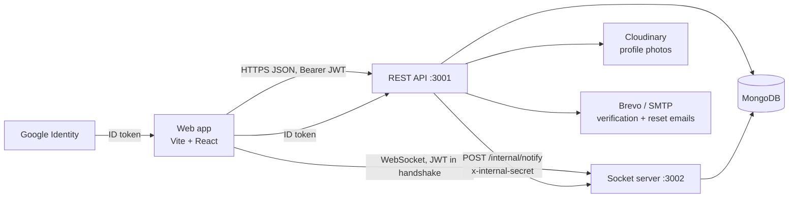
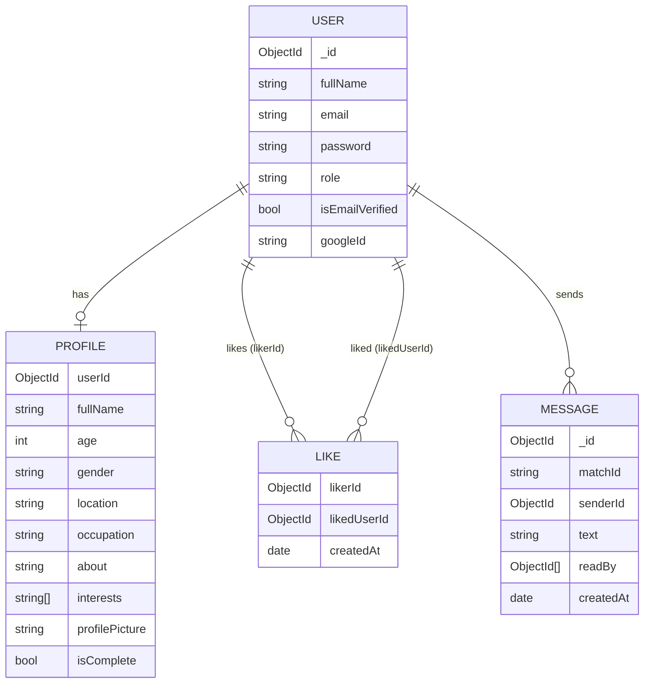

# Connectify Backend Architecture

**Status:** As-built (reflects the code in `apps/api` and `packages/shared`)
**Scope:** MVP backend — REST API plus a separate real-time socket server

> An earlier version of this document described a planned PostgreSQL/Redis/outbox
> design. The implemented system is simpler: MongoDB, JWT bearer auth, and
> Socket.IO. The planned pieces that were **not** built are listed under
> [Not yet implemented](#9-not-yet-implemented).

For route-level detail see the [API contract](./frontend-derived-backend-contract.md).

## 1. What the backend does

A signed-in person can:

- register, verify their email, log in (password or Google), reset/change their password, and delete their account;
- create a profile with a photo;
- discover other profiles (search, "all", "new", "near me");
- like and un-like profiles; a **match** is two people who have liked each other;
- chat in real time with matches, with presence, typing indicators, and unread counts;
- receive live match / like / message notifications.

It is a modular monolith: one API process (`server.ts`) plus one socket process
(`chatServer.ts`), sharing the same codebase, models, and database.

## 2. Workspace structure

```text
apps/api/src/
  server.ts               REST API bootstrap (Express)
  chatServer.ts           Socket.IO server bootstrap + internal notify endpoint
  app.ts                  Middleware and route composition
  config/                 env.ts (zod-validated), database.ts, Cloudinary.ts
  core/                   errors, logger, auth token helpers, auth middleware
  http/                   request id, rate limiter, request logger, error handler
  model/                  Mongoose models: User, Profile, Like, Message
  modules/
    auth/                 register, verify, login, Google, reset/change password, delete
    profiles/             create/read/list (discovery), photo upload
    likes/                like/unlike, liked-by-me, who-liked-me, matches
    conversations/        list, messages, send, mark-read
    preferences/          placeholder (returns 501)
    health/               /health/live, /health/ready
  routes/v1.ts            Versioned route composition
  sockets/chatSocket.ts   Chat event handlers
  MailTemplates/, utils/  Email templates and mail sending (Brevo / SMTP)
apps/web/src/             Vite + React frontend
packages/shared/src/      Zod schemas/types shared with the frontend (built to dist/)
```

A request flows as:

```text
route -> controller -> service -> Mongoose model -> response
```

Controllers unwrap the request and shape the response; services hold the rules
and talk to the models. Input is validated with zod (`@connecti/shared` for auth
inputs, `profiles.validation.ts` for profiles).

## 3. System context



| Component | Responsibility | Choice |
| --- | --- | --- |
| REST API | Auth, profiles, likes, conversations, validation, authorization | Express 5 + TypeScript |
| Socket server | Live chat, presence, typing, pushed notifications | Socket.IO on a plain `http` server |
| Database | Users, profiles, likes, messages | MongoDB via Mongoose |
| Photo storage | Profile pictures (JPEG/PNG, ≤ 5 MB) | Cloudinary (multer memory upload) |
| Email | Verification and password-reset codes | Brevo API, SMTP fallback in development |

The two Node processes are **separate deployables** (`npm run start` and
`npm run start:socket`). That allows restarting one without dropping the other's
connections, but it means code in the REST process cannot call the socket
server's `io` directly — see [the internal bridge](#63-the-internal-bridge).

## 4. Data model

MongoDB collections (Mongoose models in `apps/api/src/model`):



Key points:

- **No stored match or conversation documents.** A match is derived: A and B are matched when both a `Like(A→B)` and a `Like(B→A)` exist. A conversation id is derived too: the two user ids sorted and joined as `"<idLow>_<idHigh>"`, so both participants compute the same id.
- `Like` has a unique index on `(likerId, likedUserId)` (duplicate likes are treated as a no-op) plus an index on `likedUserId` for "who liked me".
- `Message.matchId` holds that derived conversation id and is indexed with `createdAt`.
- **Unread tracking:** `Message.readBy` lists the users who have read a message. A conversation's unread count is the number of messages *not* sent by you whose `readBy` does not include you.
- `User.password` is optional — Google-only accounts have none. `googleId` links a Google identity.
- `Profile.userId` is unique. `isComplete` is recomputed on read from the required fields (including occupation and photo).

## 5. Authentication and authorization

- **Sessions are JWTs** sent as `Authorization: Bearer <token>`. `authMiddleware` returns `401` for a missing token and `403` for an invalid/expired one. The token is signed with `JWT_SECRET_KEY` and expires per `JWT_EXPIRES_IN` (default `7d`). There are no refresh tokens or cookies.
- **Passwords** are hashed with bcrypt (12 rounds). Login returns a generic "Invalid email or password" for unknown users, Google-only accounts, and wrong passwords.
- **Email verification:** registration issues a 6-digit code (10-minute expiry) and blocks login until verified. Password reset uses the same code mechanism; the forgot-password response does not reveal whether the email exists.
- **Google sign-in:** the frontend sends a Google ID token; the API verifies it against `GOOGLE_CLIENT_ID`, then finds the user by `googleId`, links an existing account with the same email, or creates a new verified account, and returns Connectify's own JWT.
- **Messaging authorization:** every conversation read/write and every socket join goes through `assertParticipant`, which requires that the caller is one of the two users in the conversation **and** that the two currently like each other. Un-liking removes message access.
- **Sockets** authenticate at connection time from the JWT in the handshake; a connection with no valid token is disconnected immediately.

## 6. Real-time architecture

### 6.1 Rooms

On connect a socket joins a **personal room named after its user id**. It also
joins a **conversation room** (the derived `idLow_idHigh` id) when a chat window
is opened via `join_conversation`.

- Conversation rooms carry chat traffic for whoever has that chat open.
- Personal rooms reach a user wherever they are in the app. Anything that must
  be seen outside an open chat (notifications, typing in the list, unread
  badges) is pushed to the recipient's personal room.

### 6.2 Events

Client → server:

| Event | Payload | Effect |
| --- | --- | --- |
| `join_conversation` / `leave_conversation` | conversation id | Join/leave a conversation room (join is authorized) |
| `send_message` | `{ conversationId, content }` | Persists the message and broadcasts it |
| `typing_start` / `typing_stop` | `{ conversationId }` | Relays typing state |
| `get_online_users` | — | Asks for a fresh list of online user ids |

Server → client:

| Event | Sent to | Meaning |
| --- | --- | --- |
| `receive_message` | conversation room | A message in an open conversation |
| `new_message_notification` | recipient's personal room | New message (sender name, text) — drives toasts, unread badges, the bell |
| `user_typing` / `user_stop_typing` | conversation room **and** recipient's personal room | Typing state |
| `online_users`, `user_online`, `user_offline` | requester / everyone | Presence |
| `new_match` | the person who liked first | Their like was reciprocated |
| `new_like` | the liked person | Someone liked them (not yet mutual) |
| `conversation_joined`, `join_conversation_error`, `send_message_error` | requester | Acknowledgements/errors |

Presence is an in-memory map of `userId -> socket ids`. A user is online while
they have at least one socket. Because a snapshot is only pushed at connect
time, clients call `get_online_users` when a chat opens.

### 6.3 The internal bridge

Likes are created through the REST API, but the socket server owns the `io`
instance. So when a like or match happens, `likes.service.ts` calls the socket
server over HTTP:

```text
POST {SOCKET_INTERNAL_URL}/internal/notify
x-internal-secret: {INTERNAL_SOCKET_SECRET}
{ "recipientId": "...", "event": "new_match" | "new_like", "payload": { ... } }
```

The socket server rejects requests with a wrong secret (`401`) and only emits
whitelisted event names. The call is best-effort — a failure is logged but never
fails the like request itself.

## 7. Security and privacy

Implemented:

- `helmet` secure headers, an explicit CORS origin allowlist (`CORS_ORIGIN`), gzip compression, and an 8 MB JSON body limit (for profile data).
- An in-memory per-IP rate limiter (120 requests/minute, reads `x-forwarded-for`).
- Zod validation at the boundary; a stable error envelope with a request id (`x-request-id`).
- Uploads restricted to JPEG/PNG at 5 MB.
- Sensitive debug logging removed: verification codes, reset tokens, message text, and who-liked-whom data are **not** logged.
- The internal notify endpoint requires a shared secret and a fixed event whitelist.

Gaps to be aware of: the in-memory rate limiter is per-process (not shared across
instances), there are no refresh/revocable sessions, and secrets fall back to a
development default for `INTERNAL_SOCKET_SECRET` if unset — always set it in
production.

## 8. Operations

- **Configuration** is validated at startup by `config/env.ts` (zod); the process exits if `MONGODB_URI` or `JWT_SECRET_KEY` is missing. See the README for the full variable list.
- **Health:** `GET /health` (compatibility), `GET /api/v1/health/live`, `GET /api/v1/health/ready`. Note `ready` currently reports `database: not-configured` regardless of the real connection.
- **Deployment:** Render Blueprint (`render.yaml`) — `connecti-api`, `connecti-socket`, and the static frontend. Key rules: install with `--include=dev`, bind to the platform's `PORT`, cap Node's heap (`--max-old-space-size=460`), and keep `JWT_SECRET_KEY` and `INTERNAL_SOCKET_SECRET` identical across the two Node services. Details and troubleshooting are in the README.
- **Scaling note:** presence and rooms live in one socket process. Running multiple socket instances requires the Socket.IO Redis adapter (and moving presence out of memory).

## 9. Not yet implemented

Items from the original plan that do not exist yet:

- Notification preferences API (`/v1/preferences/*` returns `501`; the Settings toggles are stored in the browser's `localStorage`).
- Persisted notifications — the header bell's list is in-memory in the browser and clears on reload.
- Refresh tokens / HTTP-only cookie sessions.
- Message attachments, message deletion, group conversations.
- Precise "near me" — distance search uses place-level coordinates (a city or district centre from the geocoder), not a user's exact position, and only covers Nigeria. Profiles created before coordinates existed must re-save their location to appear.
- Automated tests. CI (`.github/workflows/ci.yml`) runs `npm ci`, `npm run typecheck`, and `npm run build` on pull requests and pushes to `main`, but there are no unit or integration tests yet.
- A worker/outbox for asynchronous jobs, Redis, and PostgreSQL (the original design; MongoDB is used instead).
