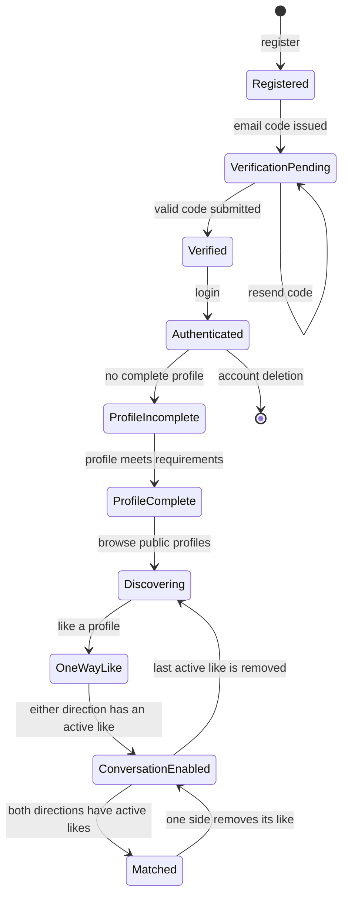
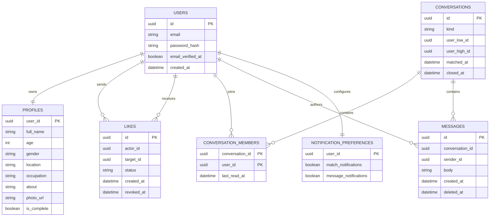

# Frontend-derived backend contract

**Status:** Approved implementation reference

This document converts the current Connectify client in `apps/web/connectify`
into the backend contract for Connecti. It is based on the client routes,
screens, contexts, and the mock API in `apps/web/connectify/src/lib/mockApi.ts`
plus the app shell in `apps/web/connectify/src/App.tsx`; it deliberately
excludes localStorage implementation details and mock-only behavior that must
not be copied into the real API.

## Source app and module mapping

The real product surface is the Connectify app currently checked in under the
workspace:

```text
apps/
  web/
    connectify/
      src/
        App.tsx
        pages/
        context/
        components/
        layout/
        lib/mockApi.ts
```

The backend contracts below are derived from these screens and behaviors:

- `apps/web/connectify/src/App.tsx` for protected and guest route structure
- `apps/web/connectify/src/context/authContext/AuthProvider.tsx` for auth state
- `apps/web/connectify/src/context/likeContext/LikesProvider.tsx` for like/match flow
- `apps/web/connectify/src/pages/*` for product features and permissions
- `apps/web/connectify/src/lib/mockApi.ts` for the canonical behavior contract


## 1. Product surface confirmed by the client

| Client area | Backend capability | Source reference |
| --- | --- | --- |
| Sign up, verification, login, password reset | Local-password identity and email verification | `pages/auth/*`, `lib/mockApi.ts` |
| Profile edit and public profile view | Profile creation, update, public read, photo upload | `ProfileEditPage.tsx`, `ViewProfilePage.tsx` |
| Discover | Public, paginated profile discovery with search and tabs | `DiscoverPage.tsx` |
| Likes and matches | Directed likes; a match occurs only after reciprocal likes | `LikesContext.tsx`, `MatchesPage.tsx` |
| Messages | One direct conversation per pair; a single active like grants messaging | `MessagesPage.tsx`, `ChatWindow.tsx` |
| Settings | Notification preferences, logout, account deletion | `SettingsPage.tsx` |

Public visitors may browse Discover and public profiles. Writing likes,
messages, profile changes, settings, or account actions requires a signed-in
user.

## 2. Canonical lifecycle



### Product rules

1. An account cannot create a session until its email is verified.
2. A profile is complete only when it has: full name, age 18–100, gender,
   location, a about of at least 10 characters, and one or more interests.
3. A like is directed: `actor -> target`. A duplicate active like is
   idempotent.
4. A match is the mutual-like state, not a separate client-created resource.
   The backend records `matchedAt` when the state is first reached so it can
   create an in-app notification and support history.
5. The current client intentionally allows messaging when *either* user has
   an active like. The relationship layer—not the route parameter—authorizes
   every message read and write.
6. If the final active like is removed, the client no longer lists the
   conversation. Preserve data for moderation/audit, but deny new reads and
   messages until a new like reopens the relationship.

## 3. API contract

All endpoints live below `/v1`. Every error uses the existing stable shape:

```json
{
  "error": {
    "code": "VALIDATION_ERROR",
    "message": "The request contains invalid data.",
    "requestId": "uuid",
    "details": {}
  }
}
```

### Authentication

| Method | Path | Purpose |
| --- | --- | --- |
| POST | `/auth/register` | Create an unverified account and issue a verification code |
| POST | `/auth/verify-email` | Verify `{ email, code }` |
| POST | `/auth/resend-verification` | Send a replacement verification code |
| POST | `/auth/login` | Create a session for a verified account |
| POST | `/auth/logout` | Revoke the current session |
| GET | `/auth/me` | Rehydrate the client session and profile |
| POST | `/auth/password-reset/request` | Request a reset without leaking account existence |
| POST | `/auth/password-reset/confirm` | Validate token/code and replace the password |

Use an HTTP-only, Secure, SameSite cookie for browser sessions. Do not return
password hashes, reset tokens, or verification codes. The client’s mock
`User.password` field is not part of the real API DTO.

### Profile and discovery

| Method | Path | Purpose |
| --- | --- | --- |
| GET | `/profiles` | Public discovery; accepts `search`, `tab`, `page`, `pageSize` |
| GET | `/profiles/:profileId` | Public profile view |
| GET | `/me/profile` | Read the current user’s editable profile |
| PUT | `/me/profile` | Create or replace the current user’s profile |
| PATCH | `/me/profile` | Partial profile update |
| POST | `/media/profile-photo/upload-url` | Request a signed image upload URL |
| POST | `/media/:mediaId/complete` | Confirm upload and attach returned photo URL |

`tab` supports `all`, `near-me`, and `new`. Use the client’s existing
page-based response until the frontend migrates to cursor pagination:

```json
{
  "items": [],
  "total": 0,
  "page": 1,
  "pageSize": 8
}
```

Profile photos accept JPEG or PNG only and have a 5 MB maximum, matching the
uploader UI. The backend returns a public-safe `profilePicture`, never storage keys
or signed URLs.

### Likes, matches, and conversations

| Method | Path | Purpose |
| --- | --- | --- |
| PUT | `/profiles/:profileId/like` | Add an idempotent active like; returns match state |
| DELETE | `/profiles/:profileId/like` | Remove the caller’s active like |
| GET | `/likes/sent` | Profiles liked by the caller |
| GET | `/likes/received` | Profiles that like the caller |
| GET | `/matches` | Profiles with reciprocal active likes |
| GET | `/conversations` | Messageable direct conversations for the caller |
| GET | `/conversations/:conversationId/messages` | Paginated messages for a permitted conversation |
| POST | `/conversations/:conversationId/messages` | Send a message to a permitted conversation |

`PUT /profiles/:profileId/like` returns:

```json
{
  "liked": true,
  "matched": false,
  "conversationId": "uuid"
}
```

The database, rather than the client, assigns an opaque conversation ID. A
unique unordered user-pair constraint prevents duplicate direct conversations.

### Preferences and account lifecycle

| Method | Path | Purpose |
| --- | --- | --- |
| GET | `/me/preferences` | Read message and match notification choices |
| PATCH | `/me/preferences` | Update `matchNotifications` and `messageNotifications` |
| DELETE | `/me` | Start a controlled account-deletion workflow |

## 4. Persistence model



Required constraints:

- unique, lowercase-normalized `users.email`;
- a check preventing a like of one’s own profile;
- unique active directed like on `(actor_id, target_id)`;
- unique direct conversation on the canonical `(user_low_id, user_high_id)`;
- message sender must be a conversation member;
- profile age range `18..100` and about length `10..200`.

## 5. Backend module plan

```text
apps/api/src/modules/
  auth/             registration, verification, sessions, password reset
  profiles/         profile validation, discovery, profile reads
  likes/            directed likes and match transition rules
  conversations/    pair lookup, membership, message authorization
  preferences/      notification choices and account settings
  media/            signed profile-photo upload lifecycle
```

Implement each module as `route -> input schema -> service -> repository ->
response mapper`. Routes do not access database tables directly.

## 6. Delivery lifecycle

1. Add PostgreSQL migrations and repositories for users, profiles, sessions,
   verification codes, and reset tokens.
2. Replace the frontend’s `mockApi` auth calls with the authentication API;
   remove localStorage session and plaintext password behavior.
3. Implement profile and discovery endpoints; replace static mock profiles
   with seeded development records.
4. Implement likes transactionally. When an active reciprocal like appears,
   set `matchedAt`, emit `match.created`, and create the direct conversation.
5. Implement conversation and message authorization based on active likes;
   add polling first and WebSocket delivery only after HTTP flows are stable.
6. Persist settings, signed photo upload, notifications, and account deletion.

## 7. Explicit product decisions still required

- Should removing the final like permanently close a conversation, or should
  previous participants retain read-only history?
- Is city text matching sufficient for “Near Me,” or do we need geographic
  coordinates and a distance radius?
- Are public profiles indexed by search engines, or public only to visitors
  inside the Connecti client?
- Which email provider will deliver verification and password-reset messages?
- Does Google sign-in remain planned? The button exists but is not yet wired.
