# Student collaboration workflow

## Team model

Work is organized by ownership, not by separate student folders. Every change
is traceable to one GitHub issue, one branch, and one pull request.

| Area       | Primary responsibility                                   | Collaborates with |
| ---------- | -------------------------------------------------------- | ----------------- |
| `apps/web` | UI, accessibility, client-side state, API integration    | API team          |
| `apps/api` | Routes, services, validation, authorization, data access | Frontend team     |
| `packages` | Shared contracts and utilities                           | Both teams        |
| `docs`     | Requirements, architecture, handoff notes                | Everyone          |

Assign students to these areas in GitHub Projects or issues. A student may
review another area, but the owner of an affected area must approve the pull
request.

## GitHub lifecycle

```mermaid
flowchart LR
  A[Issue assigned] --> B[git switch test]
  B --> C[Create feature branch]
  C --> D[Small commits]
  D --> E[Local typecheck and build]
  E --> F[Push branch]
  F --> G[Pull request to test]
  G --> H[Automated CI]
  H --> I[Peer + maintainer review]
  I --> J[Merge to test]
  J --> K[Pull latest test]
  K --> L[Issue closed]
```



## Branch rules

All students must branch from `test`, not from `main`.

```powershell
git switch test
git pull origin test
git switch -c feature/123-profile-discovery
git push -u origin feature/123-profile-discovery
```

Use one of these formats:

```text
feature/123-profile-discovery
fix/123-message-permission
docs/123-api-contract
chore/123-project-setup
```

The number is the GitHub issue number. Never reuse an old branch for a new
issue.

## Required update before every PR

Before opening or updating a PR, every student must do the following:

```powershell
git fetch origin
git rebase origin/test
git push --force-with-lease
```

This ensures the feature branch is based on the latest `test` branch and keeps
review easier for the whole cohort.

## Review rotation

Each pull request needs:

1. one peer review from another student; and
2. maintainer approval for `test`.

The author resolves comments, reruns the checks, and asks for re-review. The
author does not merge their own pull request.

## Test-branch protection

Repository administrators should enable these GitHub branch protections for
`test`:

- require a pull request before merging;
- require one approval;
- require review from code owners;
- require the `CI / quality` check to pass;
- require branches to be up to date before merging;
- block force pushes and branch deletion;
- require conversation resolution before merging.

Use squash merges to keep history readable. The PR title becomes the commit
message on `test`.

## Student expectation

Every student must:

- push their branch to the remote repository;
- keep their branch synchronized with `test`;
- pull the latest `test` before continuing work;
- open PRs against `test`, not `main`.
